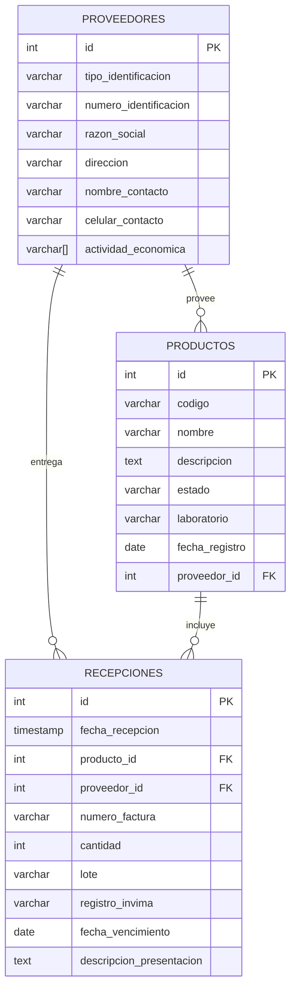

# Drugstore
--- 
Sistema de gestión para una droguería. Permite administrar proveedores, productos y recepciones de mercancía, asegurando la trazabilidad de inventarios y registros.
🗂️ Contenido
- Script de Base de Datos (DDL)
- Diagrama y Diccionario de Datos
- Repositorio del Código Fuente
- Especificación Técnica
- Instalación y Despliegue

📜 Script de Base de Datos (DDL)

CREATE DATABASE drugstore;

\c drugstore;

CREATE TABLE proveedores (
    id SERIAL PRIMARY KEY,
    tipo_identificacion VARCHAR(20) NOT NULL,
    numero_identificacion VARCHAR(30) UNIQUE NOT NULL,
    razon_social VARCHAR(150) NOT NULL,
    direccion VARCHAR(200),
    nombre_contacto VARCHAR(100),
    celular_contacto VARCHAR(20),
    actividad_economica VARCHAR(4)[]
);

CREATE TABLE productos (
    id SERIAL PRIMARY KEY,
    codigo VARCHAR(20) UNIQUE NOT NULL,
    nombre VARCHAR(150) NOT NULL,
    descripcion TEXT,
    estado VARCHAR(10) CHECK (estado IN ('Activo', 'Inactivo')),
    laboratorio VARCHAR(100),
    fecha_registro DATE DEFAULT CURRENT_DATE,
    proveedor_id INT NOT NULL,
    CONSTRAINT fk_producto_proveedor FOREIGN KEY (proveedor_id) REFERENCES proveedores(id) ON DELETE CASCADE
);

CREATE TABLE recepciones (
    id SERIAL PRIMARY KEY,
    fecha_recepcion TIMESTAMP NOT NULL DEFAULT CURRENT_TIMESTAMP,
    producto_id INT NOT NULL,
    proveedor_id INT NOT NULL,
    numero_factura VARCHAR(50) NOT NULL,
    cantidad INT NOT NULL CHECK (cantidad > 0),
    lote VARCHAR(50),
    registro_invima VARCHAR(50),
    fecha_vencimiento DATE,
    descripcion_presentacion TEXT,
    CONSTRAINT fk_recepcion_producto FOREIGN KEY (producto_id) REFERENCES productos(id) ON DELETE CASCADE,
    CONSTRAINT fk_recepcion_proveedor FOREIGN KEY (proveedor_id) REFERENCES proveedores(id) ON DELETE CASCADE
);

CREATE INDEX idx_proveedores_identificacion ON proveedores(numero_identificacion);
CREATE INDEX idx_productos_codigo ON productos(codigo);
CREATE INDEX idx_recepciones_factura ON recepciones(numero_factura);

🗃️ Diagrama y Diccionario de Datos
### Diagrama Entidad-Relación
# Diagrama Entidad-Relación - Drugstore

### Diccionario de Datos
Tabla	Campo	Tipo	Descripción
proveedores	id	SERIAL PK	Identificador único
proveedores	tipo_identificacion	VARCHAR(20)	Cédula, NIT, etc.
proveedores	numero_identificacion	VARCHAR(30)	Único por proveedor
productos	codigo	VARCHAR(20)	Código único del producto
productos	estado	VARCHAR(10)	Activo / Inactivo
recepciones	numero_factura	VARCHAR(50)	Número de factura asociado
recepciones	cantidad INT	Cantidad recibida

### Repositorio del Código Fuente
El código está disponible en un repositorio público en GitHub:
https://github.com/Miguel565/drugstore
⚙️ Especificación Técnica
🔹 Backend
•	Lenguaje de programación: JavaScript (ES6+)
•	Framework: Node.js, Express.js
•	Gestor de dependencias: npm
•	ORM: Sequelize
•	Base de datos: PostgreSQL v17
•	Servidor de aplicaciones: Render.com
•	Control de versiones: Git / GitHub
•	Versión recomendada de Node.js: v20.x
•	Versión de npm: 10.x
🔹 Frontend
•	Framework: React.js
•	Lenguaje: JavaScript (ES6+)
•	Estilos: CSS / TailwindCSS
•	Gestor de dependencias: npm
•	Herramientas adicionales: React Router, Axios
•	Versión recomendada de React: 18.x
•	Versión de TailwindCSS: 3.x

### Instalación y Despliegue
1.	1. Clonar el repositorio
   git clone https://github.com/Miguel565/drugstore.git
   cd drugstore
2.	2. Instalar dependencias
   npm install
3.	3. Configurar variables de entorno en un archivo .env:
   DB_HOST=localhost
   DB_PORT=5432
   DB_NAME=drugstore
   DB_USER=postgres
   DB_PASSWORD=tu_password
   PORT=3000
4. Crear la base de datos ejecutando el script drugstore.sql en PostgreSQL.
5.	5. Iniciar servidor local
   npm start
   Aplicación disponible en: http://localhost:3000

### Despliegue back-end en Render
   - Crear un nuevo Web Service en Render.com
   - Conectar el repositorio GitHub
   - Configurar las variables de entorno en el panel de Render
   - Deploy automático 

### Despliegue front-end en Render
   - Crear un nuevo Web Static en Render.com
   - Conectar el repositorio GitHub
   - Configurar las variables de entorno en el panel de Render
   - Deploy automático 